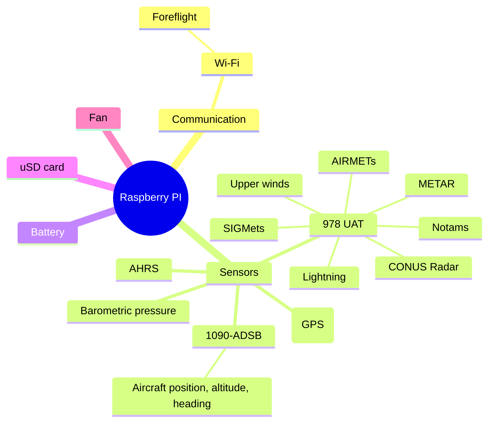

# Stratux

## US users

https://github.com/stratux/stratux/wiki/US-configuration

## EU users

This is a fork of the original cyoung/Stratux version, incorperating many contributions by the community to create a
nice, full featured Stratux image that works well for europe, the US, and the rest of the world.

(see https://github.com/stratux/stratux/wiki/Stratux-EU-Structure)

## Disclaimer
This repository offers code and binaries that can help you to build your own traffic awareness device. We do not take any responsibility for what you do with this code. When you build a device, you are responsible for what it does. There is no warrenty of any kind provided with the information, code and binaries you can find here. You are solely responsible for the device you build.

## Features
* 1090 ADSB
* UAT
* OGN receiver functionality to receive several protocols on the 868Mhz frequency band, comparable to what the OpenGliderNetwork does
* Several improvements and bug fixes to GPS handling and chip configuration (by [VirusPilot](https://github.com/VirusPilot))
* Support for transmitting OGN via a TTGO T-Beam
* More robust sensor handling
* Traffic Radar and Map
* Support for traffic output via Bluetooth LE
* Estimation of Mode-S target distance
* Support for NMEA output (including PFLAA/PFLAU traffic messages) via TCP Port 2000 and [serial](https://github.com/stratux/stratux/wiki/Stratux-Serial-output-for-EFIS's-that-support-GDL90-or-Flarm-NMEA-over-serial)
* Over-the-air (OTA) software update (between minor releases)

## Building
Due to the modular nature of Stratux, there are many possibilities how you can build it to your needs.
You can find three popular variations in the form of complete build guides [here](https://github.com/stratux/stratux/wiki/Building-Stratux-Europe-Edition).
It also shows how you can modify your pre-built Stratux US version to run the EU version.

If you want to customize beyond that, or have different needs, you can find a full list of supported hardware/attachments [here](https://github.com/stratux/stratux/wiki/Supported-Hardware).

## Major vs. minor releases

Stratux uses [semantic versioning](https://semver.org), versions are MAJOR.MINOR eg, 3.6.

### Major versions

* Are necessary due to platform library or platform configuration changes
* OTA updates are <b>not</b> supported between major versions
  * It is technically possible to use the OTA update process between
major versions. However there can be significant effort to manually develop
and test the scripts involved in that process and at present these scripts
are not being developed.

### Minor version

* OTA updates are supported between minor versions
  * Some users have Stratux units mounted in their dash or other challenging locations.

## Developing

See [DEVELOPING.md](docs/DEVELOPING.md) for details and information.

## Docs in repository vs. in wiki

User facing documentation is stored in the wiki because the wiki is:

1. Easer to edit (via browser, without needing a PR)
1. Automatically published

Developer documentation is stored in the repository because:

1. Developer documentation is typically tied tightly to code. Changes to code and developer documentation should occur together in this case. Code releases are tied to their developer documentation.
1. In-repository markdown enables PRs and PR review, ensuring accuracy and alignment with other developers.
