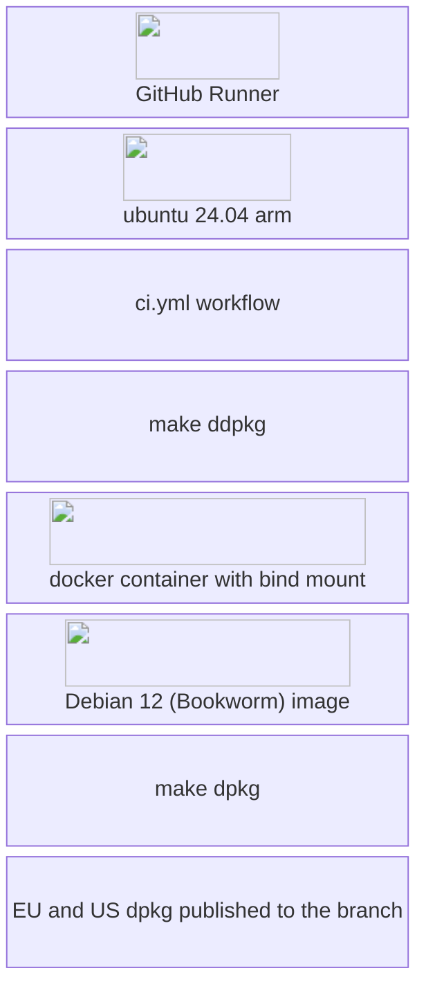
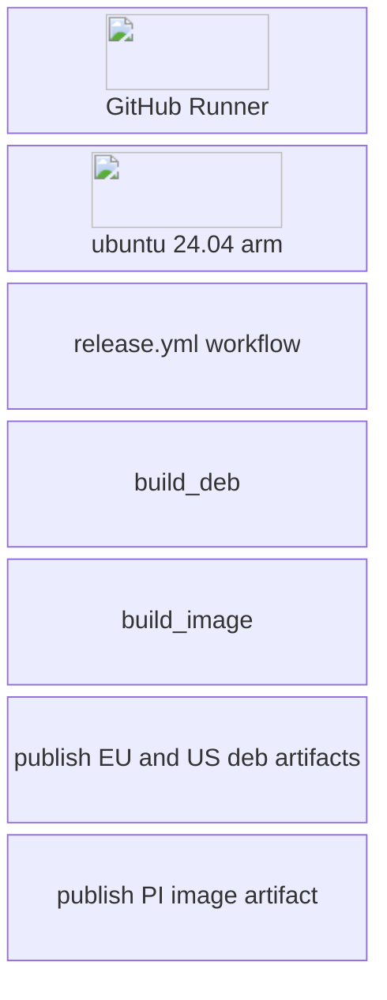
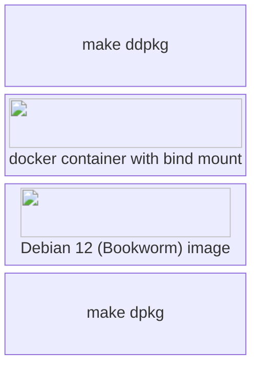
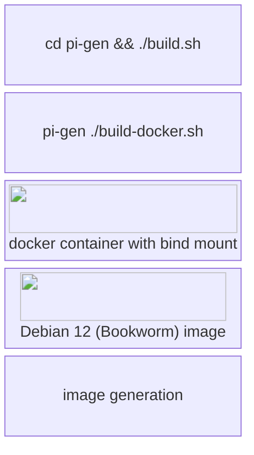

# Building

Stratux has a moderately complex build setup due to:

- Mixing Golang and C libraries
- Targetting Raspberry PI (arm64) may requires cross compiling
- Desire to develop and run on the desktop (x86-64 or arm64)
- Target versions of libraries like bluez and librtlsdr that are newer than those that ship with Debian Bookworm (the present latest RPI OS release as of 2025-02-06)

NOTE: Stratux uses submodules, ensure you have run:

```sh
git submodule update --init --recursive
```

## Ways to build Stratux

- 'make' (defaults to 'make all') - This is suitable for development and testing on a desktop system. 'make dpkg' on a platform that isn't the target Stratux OS version and architecture will not work.

- Run the 'make dall' to build via Docker.

## Github workflows

### Assumptions

- The build system *should* match the target OS for the Raspberry PI

### ci.yml



### release.yml

The release process is similar to the CI process



#### build_deb



#### build_image



# Contributing

## Coding Style
When editing code, please use the coding style that you find in the file you are editing, or similar files around it.

## Code changes
Please fork the repository and then create a pull request.

If you are planning something bigger, feel free to contact us on Discord or create a github discussion.

## For Developers with Write Access
- Small changes limited to a single portion of the code base, can be pushed directly to master. Examples:
  - A 3 line bug fix for something trivial
  - Some typo fixes in the documentation
  - Bumping a library dependency to a new, but compatible newer version
- For larger changes and/or to get feedback on a change, create a pull request. Examples:
  - Bigger refactoring spanning over multiple files
  - Adding support for new hardware
  - Implementing a new network protocol for EFB communication

## Documentation
Code should, whenever possible, be self documenting and not require an external document.
Documentation external to the code makes sense if
- What you are documenting is something general, not related to a specific piece of code
- It requires a _lot_ of documentation
- It is intended for people that don't interact with the code

Examples:
- General setup of the operating system
- Setup of a dev environment
- Description/Documentation/Reference guide of a protocol

# Interfacing with Stratux
If you are a developer of a third-party software, and want to interface with Stratux and use its data?
See [app-vendor-integration.md](app-vendor-integration.md)

# Development Environment setup
If you want to get started working on the code, see [dev_setup.md](dev_setup.md)

# OTA upgrade process

There are two mechanisms used for OTA updates in Stratux.

1. Dpkg (Debian .deb package) (<font style='background: purple'>DEB</font>)
   * Used for Stratux application updates.
1. Update script (<font style='background: green'>US</font>)
   * Was used for Stratux application updates until 2025-02-04 and remains available to perform system related update operations that are outside of the Stratux application itself, and shouldn't be included in the (<font style='background: purple'>DEB</font>) package.

Both of the update processes are similar and run through the same code paths.

## OTA update process

1. Update dpkg file(<font style='background: purple'>DEB</font>)  or (<font style='background: green'>US</font>) is uploaded via the Stratux web interface (settings.js)
1. The <font style='background: purple'>DEB</font> / <font style='background: green'>US</font> is placed in /overlay/robase/root/ (managementinterface.go handleUpdatePostRequest())
1. Stratux reboots
1. stratux-pre-start.sh runs at boot
1. If the <font style='background: purple'>DEB</font> / <font style='background: green'>US</font> is found, it is moved from /boot/firmware/StratuxUpdates/ to  /root/
1. A <font style='background: purple'>DEB</font> is installed via 'dpkg -i'
1. A <font style='background: green'>US</font> is executed
1. The <font style='background: purple'>DEB</font> / <font style='background: green'>US</font> is deleted
1. Stratux reboots again
1. Updated Stratux software starts
