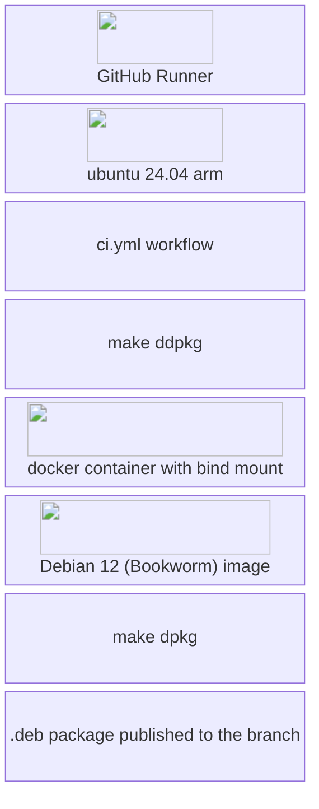
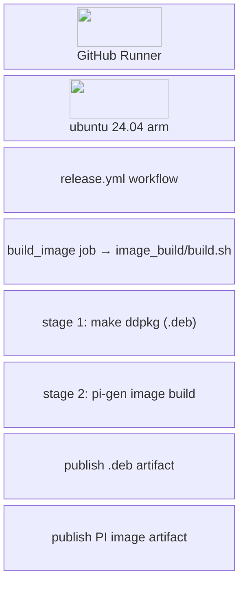
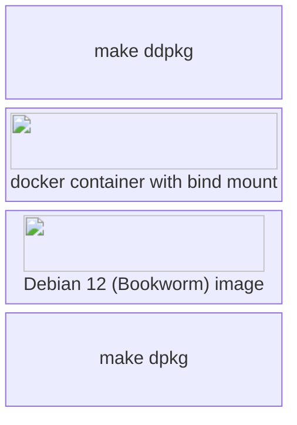
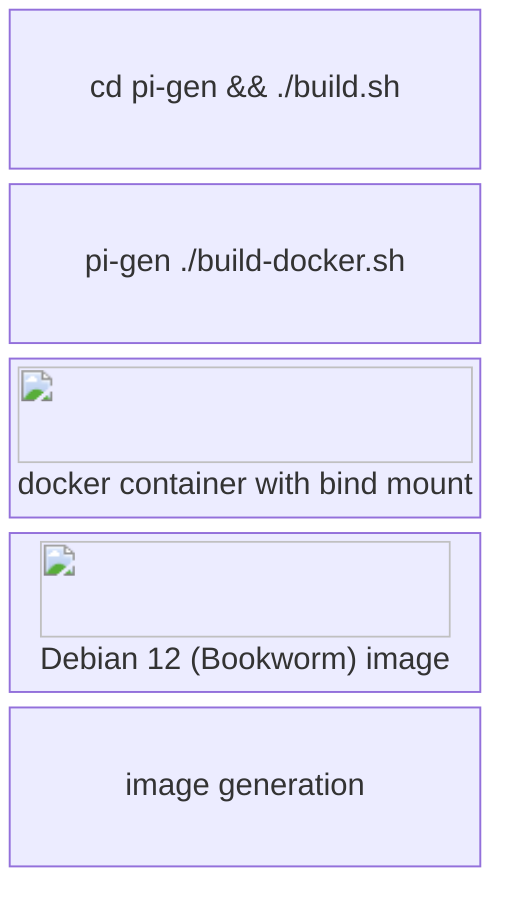

# Building

Stratux has a moderately complex build setup due to:

- Mixing Golang and C libraries
- Targetting Raspberry PI (arm64) may requires cross compiling
- Desire to develop and run on the desktop (x86-64 or arm64)
- Target versions of libraries like bluez and librtlsdr that are newer than those that ship with Debian Bookworm (the present latest RPI OS release as of 2025-02-06)

NOTE: Stratux uses submodules, ensure you have run:

```sh
git submodule update --init --recursive
```

## Ways to build Stratux

- 'make' (defaults to 'make all') - This is suitable for development and testing on a desktop system. 'make dpkg' on a platform that isn't the target Stratux OS version and architecture will not work.

- Run the 'make dall' to build via Docker.

## GitHub workflows

Stratux leverages GitHub workflows to ensure that all code changes are built, and that there is an easily reproducable mechanism to generate releases.

### Assumptions

- The build system *should* match the target OS for the Raspberry PI

### ci.yml



### release.yml

The release process is similar to the CI process, but produces both the `.deb`
package and the full Raspberry Pi SD-card image.

Unlike the diagram you might expect, `release.yml` has a **single job** (`build_image`)
that runs `cd image_build && ./build.sh`. That script does *both* steps internally:
it first builds the `.deb` (`make ddpkg`, via `pi-gen/stratux`) and then runs pi-gen
to assemble the image. The two stages below happen inside that one job, not as
separate workflow jobs.



#### stage 1 — .deb build (`make ddpkg`)



#### stage 2 — pi-gen image build



# Repository organization

## debian/

Files related to debian packages

## image_build/

Files related to the Stratux Raspberry PI image, built by pi-gen.

## How to determine what is in the debian package vs. in the image?

* Debian package contains *all* of the stratux executables.
* System image contains necessary libraries and applications for Stratux.
* Debian package contains Stratux specific configuration and udev rules
* <b>sdr-tool.sh</b> and <b>stratux-wifi.sh</b> are exceptions. These <b>ARE</b> included int
the debian package.
* However there are some oddities:
   * The <b>interfaces</b> file that references stratux-wifi.sh is a part of the image.
   * <b>stxAliases</b> that references <b>sdr-tool.sh</b> is also part of the image.


# Contributing

## Coding Style
When editing code, please use the coding style that you find in the file you are editing, or similar files around it.

## Code changes
Please fork the repository and then create a pull request.

If you are planning something bigger, feel free to contact us on Discord or create a github discussion.

## For Developers with Write Access
- Small changes limited to a single portion of the code base, can be pushed directly to master. Examples:
  - A 3 line bug fix for something trivial
  - Some typo fixes in the documentation
  - Bumping a library dependency to a new, but compatible newer version
- For larger changes and/or to get feedback on a change, create a pull request. Examples:
  - Bigger refactoring spanning over multiple files
  - Adding support for new hardware
  - Implementing a new network protocol for EFB communication

## Documentation
Code should, whenever possible, be self documenting and not require an external document.
Documentation external to the code makes sense if
- What you are documenting is something general, not related to a specific piece of code
- It requires a _lot_ of documentation
- It is intended for people that don't interact with the code

Examples:
- General setup of the operating system
- Setup of a dev environment
- Description/Documentation/Reference guide of a protocol

# Interfacing with Stratux
If you are a developer of a third-party software, and want to interface with Stratux and use its data?
See the [integration guide](integration/README.md) (GDL90, FLARM/NMEA, BLE, X-Plane, CoT) and the [HTTP/WebSocket API reference](http-api.md).

# Development Environment setup
If you want to get started working on the code, see [dev-setup.md](dev-setup.md)

# OTA upgrade process

There are two mechanisms used for OTA updates in Stratux.

1. Dpkg (Debian .deb package) (<font style='background: purple'>DEB</font>)
   * Used for Stratux application updates.
1. Update script (<font style='background: green'>US</font>)
   * Was used for Stratux application updates until 2025-02-04 and remains available to perform system related update operations that are outside of the Stratux application itself, and shouldn't be included in the (<font style='background: purple'>DEB</font>) package.

Both of the update processes are similar and run through the same code paths.

## OTA update process

The flow is overlay-filesystem aware. On a normal Stratux image the root filesystem
is mounted read-only behind an overlay, so an update has to be staged into the ext4
lower layer (`/overlay/robase/root/`) with the overlay temporarily disabled before it
can be installed. That is why more than one reboot can be involved.

1. The update file (<font style='background: purple'>DEB</font> or <font style='background: green'>US</font>) is uploaded via the Stratux web interface (`settings.js` → `POST /updateUpload`).
1. `handleUpdatePostRequest()` (managementinterface.go) creates `/boot/firmware/StratuxUpdates/` if needed and writes the upload there, then triggers a delayed reboot.
1. At boot, `stratux-pre-start.sh` runs and looks for an update in `/boot/firmware/StratuxUpdates/`.
1. **If the overlay is active:** the update is copied from `/boot/firmware/StratuxUpdates/` into the overlay lower layer (`/overlay/robase/root/`), the source is removed, the overlay is disabled, and the system reboots.
1. **On the next boot (overlay inactive):** the update is copied to `/root/`.
1. A <font style='background: purple'>DEB</font> is installed via `dpkg -i --force-depends`; a <font style='background: green'>US</font> script is executed.
1. The update file is removed and the overlay is re-enabled.
1. Stratux reboots and the updated software starts.
